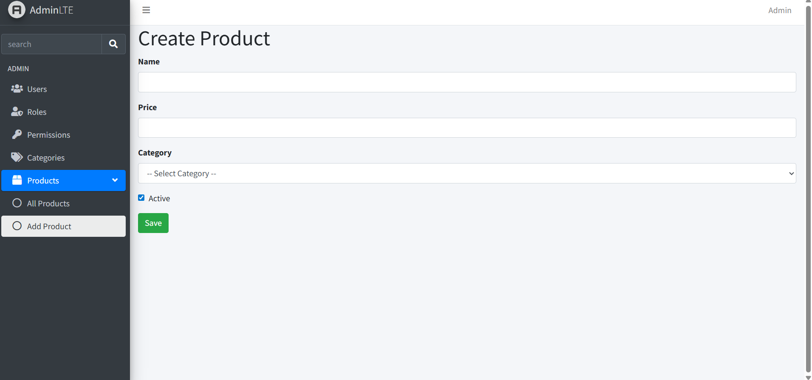
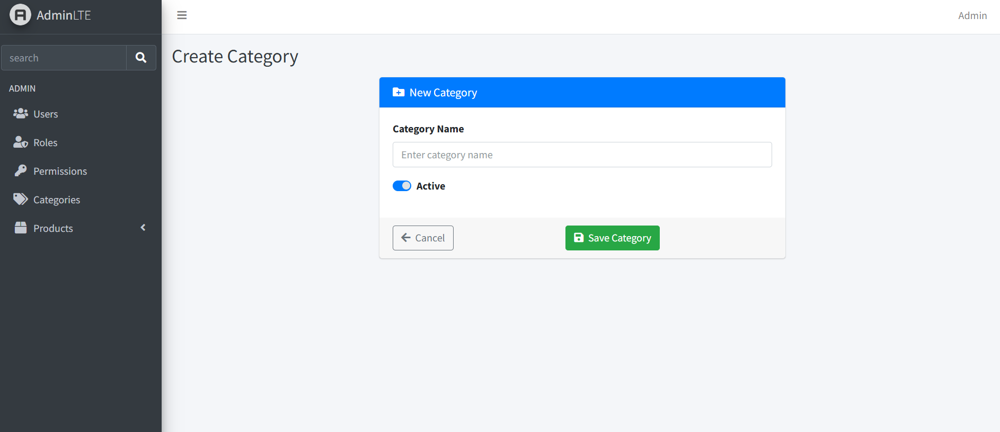
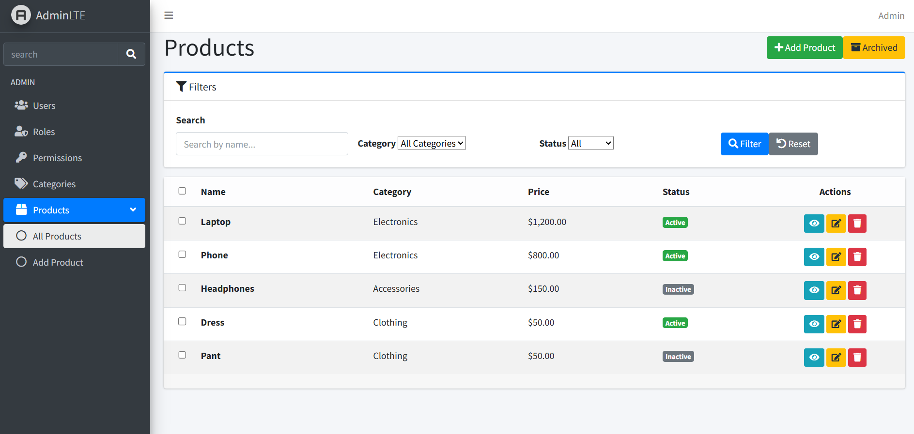
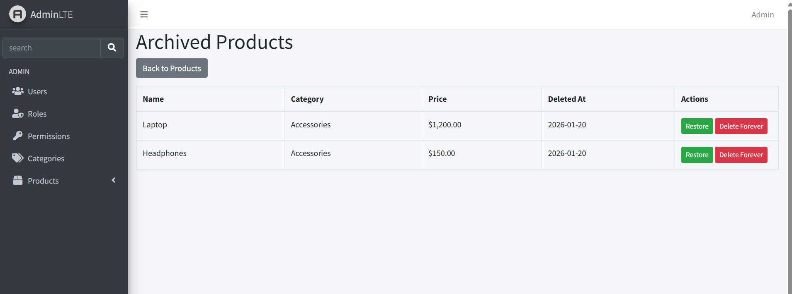

# Laravel Admin Dashboard (RBAC)

A production-ready **Laravel 12 Admin Dashboard** built with **Role-Based Access Control (RBAC)**,
products and categories management, and a clean **AdminLTE** user interface.

This project demonstrates how to build a real-world admin system with secure permissions,
clear structure, and maintainable Laravel code suitable for business applications.

---

## ✨ Features

- 🔐 Authentication (Login / Logout)
- 👤 Role-Based Access Control (RBAC) using **Spatie Laravel Permission**
- 📦 Products management (Create, Read, Update, Delete)
- 🗂 Categories management (Create, Read, Update, Delete)
- 🔗 Product–Category relationship
- 🗃 Soft Delete (Archive & Restore)
- 🔍 Filtering by category and status
- 🎨 AdminLTE dashboard UI
- 🌱 Database seeders for demo data

---

## 🧰 Tech Stack

- Laravel 12
- PHP 8.3
- MySQL
- AdminLTE
- Spatie Laravel Permission
- Bootstrap 5

---

### After seeding the database, log in using:

- **Email:** admin@example.com  
- **Password:** password123  

---

## 📸 Screenshots

### Create Product

### Create Category

### Product List

### Archived Products

---

## 🎥 Demo Video

👉 [Click here to watch the demo video](docs/video/demo.mp4)
